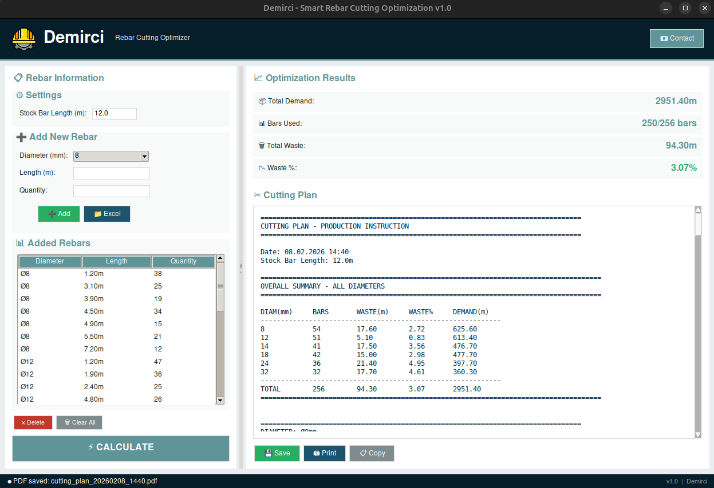
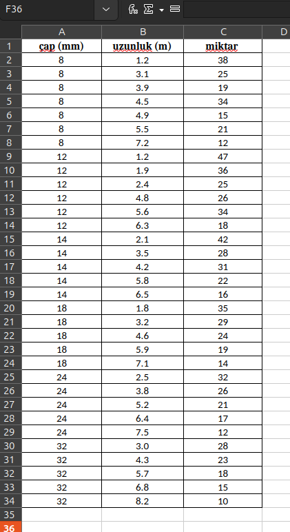
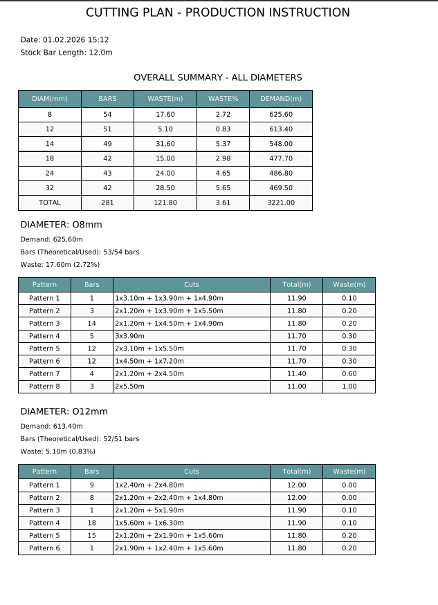

# Demirci - Smart Rebar Cutting Optimizer

🏗️ Professional rebar cutting optimization tool using lexicographic optimization algorithm.

## Features

- ✂️ Multi-diameter rebar optimization
- 📊 Minimizes waste and number of bars
- 📁 Excel/CSV/ODS file import support
- 💾 Export to TXT, Excel, PDF
- 🎯 Adaptive efficiency algorithm
- 🖥️ User-friendly GUI interface

## Screenshots





## Installation

### Requirements
- Python 3.8+

### Install Dependencies
```bash
pip install -r requirements.txt
```

## Usage
```bash
python main.py
```

### Basic Steps:
1. Enter rebar diameter, length, and quantity
2. Click "Add" or load from Excel
3. Click "Calculate"
4. View and export results

### Excel Import Format:
| Çap (mm) | Uzunluk (m) | Adet |
|----------|-------------|------|
| 12       | 3.5         | 10   |
| 16       | 5.2         | 8    |

## Algorithm

Uses **Lexicographic Optimization**:
1. **Phase 1**: Minimize number of bars
2. **Phase 2**: Minimize waste (if needed)

## Examples

See `/examples` folder for sample inputs and outputs.

## Technical Details

- **Solver**: OR-Tools (SCIP/CBC)
- **GUI**: Tkinter
- **Optimization**: Column Generation + Integer Programming

## License

MIT License

## Contact

📧 civileng.serdar@gmail.com  
🔗 [GitHub Profile](https://github.com/srdrgl)

## Contributing

Pull requests welcome! Please open an issue first.
